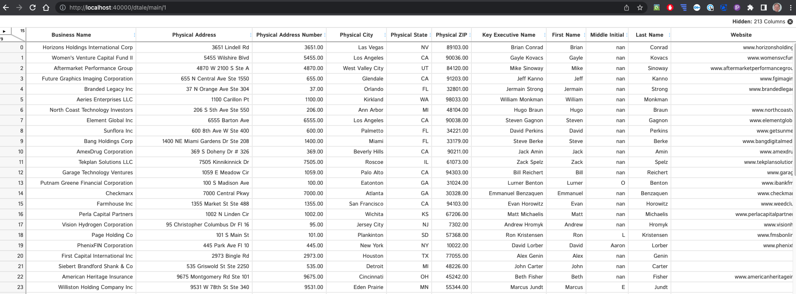

# business-records

 - business data retrieved from AtoZ using library account, available as a csv
 - this csv file is read in to a dataframe
 - displayed for review using DTale

building the docker container:  
```
docker build -t business-records:latest .
```

running the docker container:  

```
$ docker run -v $(pwd)/app:/app -p 40000:40000 business-records
```

open browser to localhost:40000 


